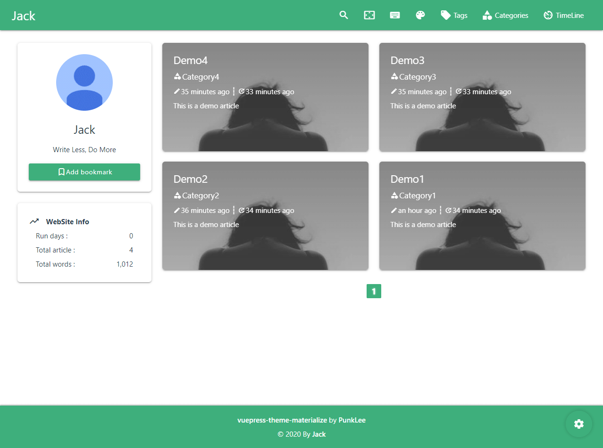
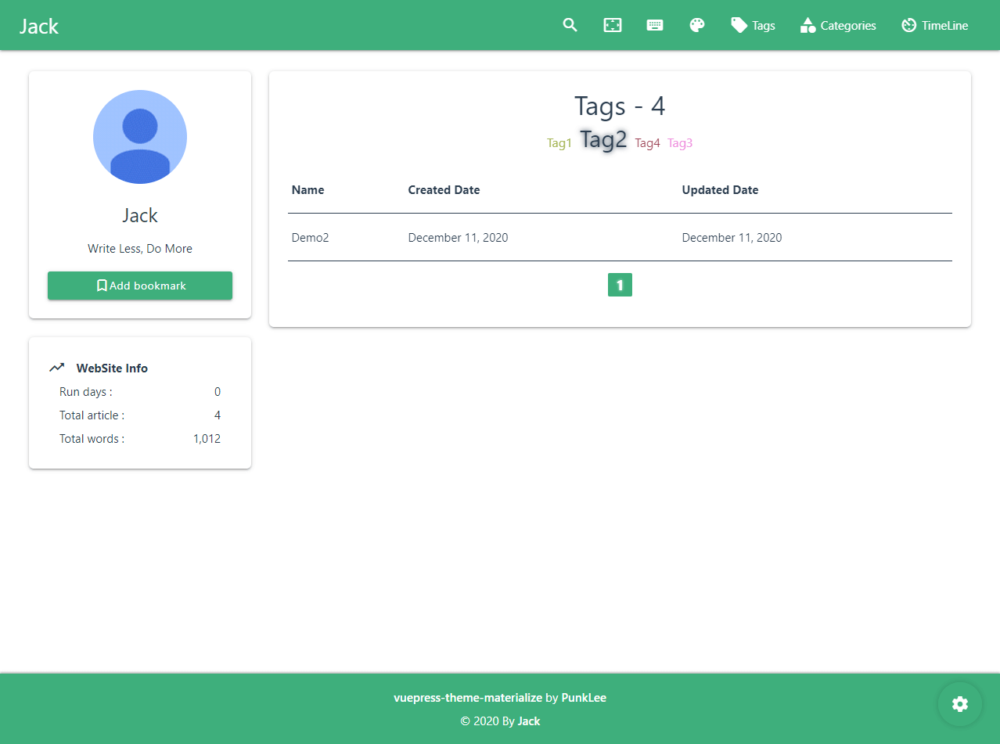
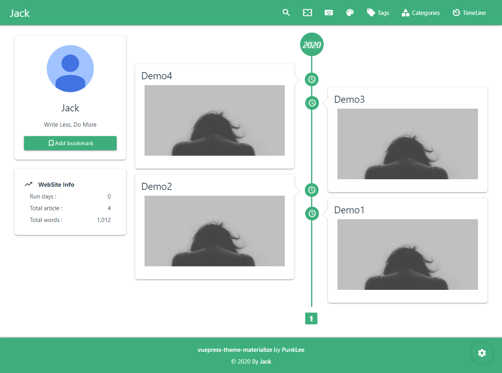

# vuepress-theme-materialize

Materialize theme for VuePress

## 介绍

-   This is a Vuepress theme
-   Themes built with [Materialize UI](https://materializecss.com/)
-   Designed to provide the most convenient experience

## 快速开始

### npm

```bash
npm install vuepress-theme-materialize -D
```

### vuepress

```js
// .vuepress/config.js
module.exports = {
    title: "Jack",
    description: "Write Less, Do More",
    theme: "materialize",
};
```

## 博客预览

### 主页



### 标签页



### 时间轴页



### 演示博客

[PunkLee Blog](https://punk_lee.gitee.io/)

## FrontMatter

一个完整的`frontmatter`:

```yaml
---
title: Hello VuePress
tags:
    - vue
    - vuePress
categories:
    - vue
description: Vue-powered Static Site Generator
cover: /images/vuepress/cover.png
coverStyle: { object-fit: scale-down }
sticky: TOP
toc: false
comments: false
password: 20201211
---

```

### 预定义变量

**title**

-   类型:`string`
-   Default:`该文件名`
-   说明: 文章的标题

**tags**

-   类型:`array`
-   Default:`[]`
-   说明: 文章的标签

**categories**

-   类型:`array`
-   Default:`[]`
-   说明: 文章的类别

**description**

-   类型:`string`
-   Default:`获取文章前78个字符（除了HTML标签）`
-   说明: 文章的描述

**cover**

-   类型:`string`
-   Default:`$themeConfig.img.global`
-   说明: 文章的封面

**coverStyle**

-   类型:`string`
-   Default:`undefined`
-   说明: 文章的封面样式

**sticky**

-   类型:`string`
-   Default:`undefined`
-   说明: 使文章置顶，填写的内容将作为置顶的文字

**toc**

-   类型:`boolean`
-   Default:`true`
-   说明: 文章的侧边栏目录，默认开启

**comments**

-   类型:`boolean`
-   Default:`true`
-   说明: 文章的评论，默认开启

**password**

-   类型:`string`
-   Default:`undefined`
-   说明: 文章的密码

## 主题的配置

> **tips:** 默认开启所有页面（标签/分类/时间轴页面）

### 基础配置

默认为:

```js
// .vuepress/config.js
module.exports = {
    themeConfig: {
        avatar: "", // 你的头像图像
        notice: "", // 在侧边小部件中展示的公告
        sort: "ctime", // 文章默认按照创建时间来排序
        docsDate: "", // 'docs' 文件夹的创建时间，将显示为博客的运行天数
        footer: {
            start: "", // 博客的起始日期
            end: "", // 博客的到期日期，默认自动获取
            customText: "", // or ["text1", "text2 <a href='/'>link</a>", ...]
            themeInfo: true, // or false: 禁止显示主题的信息
        },
        pagination: {
            perPage: 6,
            range: 3,
        },
    },
};
```

**avatar||notice**

-   类型:`string`

**sort**

-   类型:`string`
-   可选值: `ctime` `mtime`

**docsDate**

-   类型:`string`
-   格式: `YYYY-MM-DD HH:mm:ss`

### 标签/分类/时间轴 页面

默认为:

```js
// .vuepress/config.js
module.exports = {
    themeConfig: {
        tags: {
            text: "",
            icon: "local_offer",
            location: 0,
            tableClass: "",
        },
        categories: {
            text: "",
            icon: "category",
            location: 0,
            tableClass: "",
        },
        timelines: {
            text: "",
            icon: "av_timer",
            location: 0,
        },
    },
};
```

**text**

-   类型:`string`
-   说明: 在博客或导航栏显示的文本

**icon**

-   类型:`string`
-   说明: 在博客或导航栏显示的图标

**location**

-   类型:`number`
-   说明: 在博客或导航栏显示的位置

**tableClass**

-   类型:`string`
-   可选样式: `striped` `highlight` `centered`
-   说明: 在“标记/类别”页中呈现的表格样式

### Navbar

例子:

```js
// .vuepress/config.js
module.exports = {
    themeConfig: {
        nav: [
            // 在导航栏中的单链接:
            {
                text: "first link",
                icon: "extension",
                link: "https://google.com",
                target: "_self",
                location: 1,
            },

            // 在导航栏中的下拉列表:
            {
                text: "AboutMe",
                items: [
                    {
                        text: "Github",
                        icon: "link",
                        link: "https://github.com/xxxxx",
                    },
                    {
                        text: "Gitee",
                        icon: "link",
                        link: "https://gitee.com/xxxxx",
                    },
                ],
            },
        ],
    },
};
```

**text**

-   类型:`string`
-   说明: 导航栏中显示的文本

**icon**

-   类型:`string`
-   说明: 导航栏中显示的图标

**link**

-   类型:`string`
-   说明: 导航栏链接

**location**

-   类型:`number`
-   说明: 导航栏中显示的位置

**target**

-   类型:`string`
-   可选: `_blank` `_self`

### 页面加载效果

默认为:

```js
// .vuepress/config.js
module.exports = {
    themeConfig: {
        pageLoading: { text: "", com: 0, side: "", delay: 0 },
    },
};
```

**text**

-   类型:`string`
-   说明: 被预加载效果包裹的文本

**com**·

-   类型:`number`
-   可选: `0-12`
-   说明: 组件的索引值

**side**

-   类型:`string`
-   可选: `left` `right` `top` `bottom`
-   说明: 加载效果结束的方向

**delay**

-   类型:`number`
-   说明: 延迟加载效果（毫秒）

### 页面的文章卡

默认为:

```js
// .vuepress/config.js
module.exports = {
    themeConfig: {
        pagePost: { side: "right", com: 0 },
    },
};
```

**side**

-   类型:`string`
-   可选:`left` `right`
-   说明: 页面中文章列表的位置

**com**

-   类型:`number`
-   可选: `0-2`
-   说明: 组件的索引值

### 页面的小部件

默认为:

```js
// .vuepress/config.js
module.exports = {
    themeConfig: {
        pageWidgets: {
            sticky: false, // 粘性布局
            CardInfo: true,
            CardNotice: true,
            CardClock: false,
            CardSiteInfo: true,
        },
        // 设为false将全部禁用
        // pageWidgets: false,
    },
};
```

### 页面的顶部 Banner

默认为:

```js
// .vuepress/config.js
module.exports = {
    themeConfig: {
        pageBanner: {
            enable: false, // or ["/", "/tags/", "/categories/", "/timelines/"]
            effect: 0,
            title: "",
            text: "", // or ["text1", "text2", ...]
            items: "", // or ["img1", "img2", ...]
            style: {},
        },
    },
};
```

**enable**

-   类型:`boolean||array`
-   说明: `true || false` 全部启用或全部禁用, `["/tags/", "/categories/"]` 只显示在列表中指定的路由地址

**effect**

-   类型:`number`
-   可选: `1-10`
-   说明: 标题的效果，默认禁用

**title**

-   类型:`string`
-   说明: 如未设置`effect`的值，将和`text`的效果相同

**text**

-   类型:`string||array`
-   说明: banner 中显示的文本

**items**

-   类型:`string||array`
-   说明: banner 中显示的图像，可设置多张图像

### 搜索配置

> 目前只支持本地搜索

默认为:

```js
// .vuepress/config.js
module.exports = {
    themeConfig: {
        search: {
            placeholder: "Please enter title/tag/category", // 占位符
            maxSuggestions: 10, // 搜索结果的最大建议数
            hotKeys: "F2", // 热键
        },
    },
};
```

### 评论配置

> 目前只支持 [Valine](https://valine.js.org/)

> `appId` 和 `appKey` 是必需的，不然无法使用评论功能

The default as:

```js
// .vuepress/config.js
module.exports = {
    themeConfig: {
        valine: {
            appId: "",
            appKey: "",
            avatar: "retro",
            visitor: true,
            lang: "en",
        },
    },
};
```

### 404 页面

默认为:

```js
// .vuepress/config.js
module.exports = {
    themeConfig: {
        page404: {
            message: "BAD REQUEST", // or ["msg1", "msg2"]
        },
    },
};
```

**message**

-   类型:`string||array`
-   说明: 404 页面显示的文本，如果设置的值是数组，则随机显示

### 额外配置

```js
// .vuepress/config.js
module.exports = {
    themeConfig: {
        // 侧栏中的颜色选项
        colorList: [],

        // 全局图像设置
        img: {
            loading: "", // "/loadingImg.gif" or "loadingImg.svg"
            loadingSvg: 10, // 0 ~ 11 // if not set loading, default to use theme svg effects
            error: "", // "/errorImg.png"
            global: "https://picsum.photos/400/200", // For posts without a cover
        },
    },
};
```

## ThemeStyle

[palette.styl](./styles/palette.styl)

## ChangeLog

[ChangeLog](https://github.com/PunkLee2py/vuepress-theme-materialize/blob/main/CHANGELOG.md)

## License

[MIT](https://github.com/PunkLee2py/vuepress-theme-materialize/blob/main/LICENSE)
